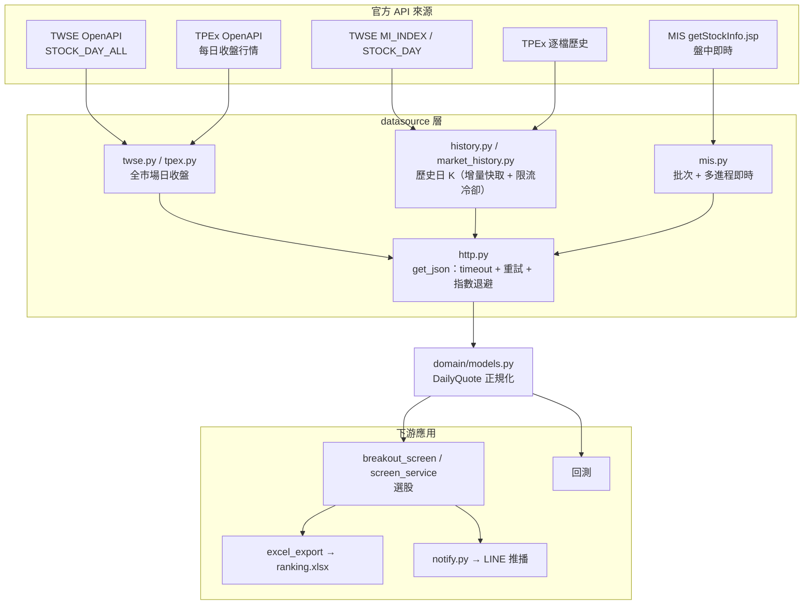

# 資料來源 (爬蟲) 說明

本專案的「爬蟲」集中在 `stock_quant/datasource/`。
全部打**台灣官方 JSON API**（證交所 TWSE、櫃買 TPEx、證交所 MIS），
不做網頁 HTML 解析，零第三方依賴（只用標準函式庫 `urllib`）。

所有來源最後都正規化成統一的 `DailyQuote` 值物件，下游選股／回測只認這個格式。

---

## 一、抓取的三類資訊

| 類別 | 用途 | 模組 | 端點 | 範圍 |
|---|---|---|---|---|
| **全市場日收盤** | 每日選股 | `twse.py` / `tpex.py` | TWSE `STOCK_DAY_ALL` TPEx `tpex_mainboard_daily_close_quotes` | 最後交易日 · 全部個股 |
| **歷史日 K** | 回測 / 技術指標 | `history.py` / `market_history.py` | TWSE `MI_INDEX`（逐日）+ `STOCK_DAY`（逐月） TPEx 逐檔歷史 | 多月 / 多年 · 逐檔或全市場 |
| **盤中即時報價** | 當日盤中 | `mis.py` | MIS `getStockInfo.jsp` | 即時（約數秒更新）· 批次多檔 |

> 預設 `only_individual=True`：只保留普通股，濾掉 ETF／權證／特別股等非個股商品。

### `DailyQuote` 正規化欄位

`股票代號`、`名稱`、`市場`、`交易日`、`開`、`高`、`低`、`收`、
`漲跌價差`、`成交股數`、`成交金額`、`成交筆數`

> 目前資料僅止於**價量**。尚未抓三大法人買賣超、融資券、財報等籌碼／基本面資料。
> 若要新增，只需實作一個新的 `IDataSource`，crawler 不需改動（符合 OCP）。

---

## 二、資料流

---

## 三、防限流設計（重點）

`MI_INDEX` 對連續請求限流很嚴，觸發後會把 IP 擋上「好幾分鐘」，因此 `market_history.py`：

- 每天只打 **1 次**請求（新端點失敗才退舊端點），不在封鎖窗內快速重試
- 每天之間留間隔（`delay` 預設 3s）
- 被擋時冷卻後重試；連續多天被擋就「判定 IP 被鎖、停止抓取」，不硬敲
- **逐日增量快取 + 續抓**：抓到的每個交易日存進快取（`.cache/*.pkl`），
  下次啟動由最新往回補沒抓到的日子，中斷後過幾分鐘再跑就會接著補齊

MIS 同樣有流量限制，靠 `batch_size` 控制單批檔數、多進程平行，全市場約一分鐘抓完。

---

## 四、共用 HTTP 行為

`http.py` 的 `get_json()` 統一處理：
`timeout`（預設 30s）、`retries`（預設 3 次）、指數退避（`backoff` 1.5），
並帶瀏覽器 UA／各來源所需的 `Referer`（證交所／櫃買／MIS 對 bot UA 較敏感）。

---

## 五、不是爬蟲的兩個檔

| 檔案 | 實際功能 |
|---|---|
| `limits.py` | 純本地計算：升降單位（tick）、漲停價、漲停前一檔，不連網 |
| `netinfo.py` | 抓 GCP VM 對外 IP（metadata server），開機推 LINE，與股市無關 |
