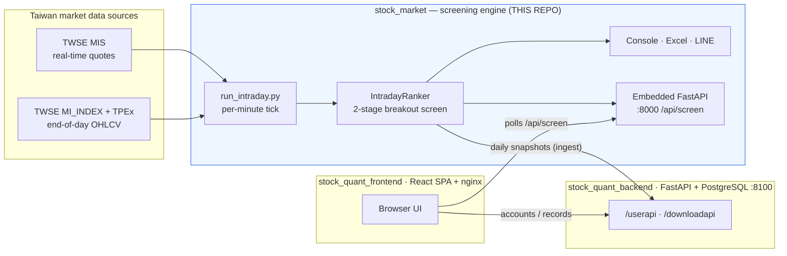

# Stock Quant — Taiwan-Stock Intraday Breakout Screener (Engine)

> Real-time + end-of-day screening engine for the Taiwan stock market. It scans the
> **entire market every minute** during trading hours, finds stocks that are *starting
> to break out*, and serves the results over a small HTTP API, an Excel file, and
> optional LINE push notifications.

**Tech:** Python 3.10+ · Poetry · FastAPI (embedded, optional) · multiprocessing · Docker

> ⚠️ The screening output is probabilistic, lagging, reference information only — **not investment advice.**

This is the **data/compute engine** of a three-part system. The companion repositories are
`stock_quant_backend` (user accounts & saved records) and
[`stock_quant_frontend`](https://github.com/jummy1124/stock_quant_frontend) (the React UI).

---

## Why I built it

Manually watching a 1,900-stock market for intraday breakouts is impossible. I wanted a
system that does the watching for me: every minute it pulls live quotes for the whole
market, applies a disciplined, rule-based breakout filter, and surfaces only the handful
of names worth a look — with the same logic available as a CLI, an Excel report, a push
notification, and a JSON API a web UI can poll.

The interesting engineering is **doing this reliably against rate-limited public data
sources** without hammering them, and making a single run serve four different consumers
without ever fetching the same quote twice.

## Highlights

- **Two-stage, fully rule-based screen** (no black box): a "gainer pool" pre-filter,
  then 6 hard breakout conditions — easy to explain in an interview and easy to test.
- **One process, four outputs.** A single per-minute tick feeds the console, Excel, LINE,
  and the embedded HTTP API from the *same* snapshot — zero duplicate crawling.
- **Resilient data ingestion.** Whole-market fetches are batched across processes with
  **per-batch error isolation**, exponential back-off, and an **incremental on-disk cache**
  so a rate-limit on one batch never sinks the whole scan.
- **Automatic live ⇄ end-of-day switching** based on a Taipei-timezone market clock.
- **Clean layering** (domain → datasource → engine → delivery) with dependency inversion,
  so the core logic has zero web/DB/vendor imports and is trivially unit-testable.
- **Zero-dependency test runner** — the full suite runs with the standard library only.

## System architecture



## How the screen works

For every stock with a known *previous close* and a *current price*, the engine computes
`change% = (price − prev_close) / prev_close × 100`, then applies two stages:

**Stage 1 — gainer pool**
1. `change% ≥ 3%` (configurable via `--min-change`)
2. price `≤` one tick below the limit-up price (locked limit-up names excluded; opt back
   in with `--include-limit-up`). Limit-up is computed from Taiwan tick-size rules.

**Stage 2 — six "breakout" conditions** (the default view)
A stock qualifies as *starting to break out* when it shows a **red (up) candle**, **breaks
the previous day's high**, **volume ratio ≥ 1.2×**, **trades above the 5-day MA**, the
**20-day MA is sloping up**, and the **previous day closed below the 5-day MA**. Some
parameters (volume ratio, MA windows, slope look-back, full-day volume projection) are
tunable; the rest are fixed structural conditions.

Only ordinary common stocks are scanned — ETFs, warrants, preferred shares and futures are
filtered out by ticker convention.

## Tech stack

| Area | Choice |
|---|---|
| Language | Python 3.10+ |
| Packaging | Poetry (`pyproject.toml` + `poetry.lock`) |
| Concurrency | `multiprocessing` for batched whole-market fetches |
| HTTP API | FastAPI + Uvicorn (optional `api` dependency group) |
| Output | `openpyxl` (Excel), LINE Messaging API (push) |
| Runtime | Docker + docker compose (TZ = `Asia/Taipei`) |
| Tests | standard-library runner (`tests/run_tests.py`); `pytest`-compatible |

## Getting started

### Prerequisites
- Python **3.10+**
- [Poetry](https://python-poetry.org/) (`pipx install poetry`) — or just use Docker

### Option A — Run locally with Poetry

```bash
git clone <this-repo> && cd stock_market
poetry install                 # core deps (openpyxl)
poetry install --with api      # add this if you want the embedded HTTP API (--serve)

# Optional: enable LINE push / snapshot ingest
cp .env.example .env           # then fill in the values you need (see below)

# Run it
poetry run python run_intraday.py            # per-minute screen + writes ranking.xlsx
poetry run python run_intraday.py --once     # run a single pass and exit
```

> No virtualenv? `pip install openpyxl` and run `python run_intraday.py` directly — the
> CLI itself only needs `openpyxl`. FastAPI/Uvicorn are only required for `--serve`.

### Option B — Run with Docker (recommended for the long-running service)

```bash
cp .env.example .env           # edit if you want LINE / ingest; otherwise defaults are fine
docker compose up -d --build
```

This starts the per-minute screener **and** the embedded API on port `8000`, persists the
history cache in a named volume, and writes `ranking.xlsx` to `./data`. Verify:

```bash
curl http://localhost:8000/health           # {"status":"ok"}
curl http://localhost:8000/api/screen       # latest screening snapshot (JSON)
# Swagger UI: http://localhost:8000/docs
```

## CLI usage

```bash
python run_intraday.py                       # default: screen 3%~limit-up, write ranking.xlsx
python run_intraday.py --once                # one pass now (live during hours, else last EOD)
python run_intraday.py --min-change 5        # raise the gainer threshold to 5%
python run_intraday.py --no-filter           # whole-market gainer ranking (no screen)
python run_intraday.py --top 50              # console/LINE show top 50 (Excel still full)
python run_intraday.py --excel out/today.xlsx
python run_intraday.py --serve --api-port 8000   # also expose the HTTP API
python run_intraday.py --notify line             # daily 13:00 LINE digest (needs .env)
python run_intraday.py 2330 2317                 # watch specific tickers only
```

Sample console output:

```
===== Breakout screen (3%~limit-up) 2026-06-12 11:30:00 [LIVE] — 2 matched / 1900 quotable / 1955 universe =====
   #  Symbol  Name           Market     Price    Chg     Chg%      Vol(lots)
--------------------------------------------------------------------------
   1  2330    TSMC           TWSE      109.50    9.50    9.50            25
   2  2317    Hon Hai        TWSE      103.00    3.00    3.00             9
```

## Embedded HTTP API

Enable with `--serve` (or via Docker). Interactive docs live at `/docs`.

| Method | Endpoint | Purpose |
|---|---|---|
| GET | `/health` | Liveness/readiness probe |
| GET | `/api/meta` | Snapshot metadata (source, freshness, counts, warnings) |
| GET | `/api/screen` | Latest breakout results (accepts user filter params) |
| GET | `/api/screen-defaults` | Server-side default screen parameters |
| GET | `/api/pool` | Stage-1 gainer pool |
| GET | `/api/history/{symbol}` | ~6 months of daily candles (+ intraday today) |
| GET | `/api/quote/{symbol}` | Latest quote for one symbol |

The loop computes once per minute and **publishes a single immutable snapshot**; the API
only reads that snapshot, so HTTP traffic never triggers extra crawling. User-supplied
filter parameters are re-applied to the cached raw rows on the fly.

## Data sources & resilience

- **Live quotes:** TWSE MIS endpoint, fetched in parallel batches with per-batch error
  isolation (a throttled/timed-out batch is reported as a coverage warning, not a crash).
- **End-of-day:** TWSE `MI_INDEX` (listed) + TPEx OpenAPI (OTC), normalized into a single
  `DailyQuote` model.
- **History cache:** incremental, on-disk (`.cache/history.pkl`), back-filled newest-first
  so the latest trading day is always topped up even after a rate-limit interruption.
- **After-close merge** pulls each market's completed daily K **independently** and only
  marks the day done once *every* market is merged — so a late/rate-limited market never
  leaves the board stuck on the previous trading day.

## Project structure

```
stock_market/
├── run_intraday.py            # single entry point: live/EOD switch, screen, Excel, LINE, --serve, --ingest
├── stock_quant/
│   ├── domain/                # DailyQuote / Market value objects (no framework imports)
│   ├── datasource/            # universe list, history (cached), MIS live, TWSE/TPEx EOD, market clock dates
│   ├── limits.py              # Taiwan tick sizes + limit-up / one-tick-below-limit
│   ├── intraday.py            # IntradayRanker: ranking + 2-stage screen, live⇄EOD auto-switch
│   ├── breakout_screen.py     # the 6 breakout conditions (stage 2)
│   ├── screen_service.py      # thread-safe snapshot holder for the API
│   ├── api.py                 # embedded FastAPI app (--serve)
│   ├── excel_export.py        # openpyxl writer
│   ├── notify.py              # LINE push (daily digest / realtime, dedup) + .env loader
│   ├── ingest.py              # POST daily snapshots to the user-data backend
│   └── scheduler.py           # MarketClock (Taipei) + per-minute loop
└── tests/                     # run_tests.py (zero-dep) + test_*.py
```

## Configuration (`.env`, optional)

Only needed for LINE push and/or snapshot ingest; copy `.env.example` to `.env`.

| Variable | Purpose |
|---|---|
| `LINE_CHANNEL_TOKEN` / `LINE_USER_ID` | LINE Messaging API push (comma-separate multiple users) |
| `INGEST_URL` / `INGEST_TOKEN` | POST daily screening snapshots to `stock_quant_backend` (token must match the backend) |
| `ALLOWED_ORIGINS` | CORS origins for the embedded API (default `*`) |

## Testing

```bash
python tests/run_tests.py      # zero-dependency runner, auto-discovers tests/test_*.py
# pytest also works if you prefer: pytest -q
```

The suite covers the ranking math, the 2-stage screen, limit-up rules, the live/EOD
switch, and the after-close per-market merge logic — all with mocked data sources, so it
runs offline in milliseconds.

## Design decisions worth calling out

- **Dependency inversion at the data layer** keeps `domain/` and the screening engine free
  of vendor/HTTP code, so the rules are testable without a network.
- **Compute-once, serve-many:** the per-minute snapshot is the single source of truth for
  every output channel — the API is a pure reader.
- **Be polite to public APIs:** batching, back-off, incremental caching and per-batch
  isolation are deliberate choices to stay under TWSE rate limits rather than fight them.

---

*Disclaimer: this project is for technical and educational purposes. Screening results are
probabilistic, lagging, and **not investment advice**.*
