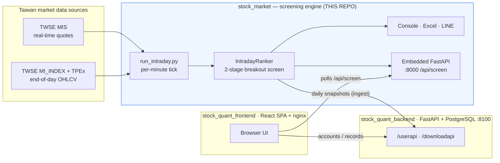

# Stock Quant — Taiwan-Stock Intraday Breakout Screener (Engine)

> Real-time + end-of-day screening engine for the Taiwan stock market. It scans the
> **entire market every minute** during trading hours, finds stocks that are *starting
> to break out*, and serves the results over a small HTTP API, an Excel file, and
> optional LINE push notifications.

**Tech:** Python 3.10+ · Poetry · FastAPI (embedded, optional) · multiprocessing · Docker

> ⚠️ The screening output is probabilistic, lagging, reference information only — **not investment advice.**

This is the **data/compute engine** of a three-part system. The companion repositories are
`stock_quant_backend` (user accounts & saved records) and
[`stock_quant_frontend`](https://github.com/jummy1124/stock_quant_frontend) (the React UI).

---

## Why I built it

Manually watching a 1,900-stock market for intraday breakouts is impossible. I wanted a
system that does the watching for me: every minute it pulls live quotes for the whole
market, applies a disciplined, rule-based breakout filter, and surfaces only the handful
of names worth a look — with the same logic available as a CLI, an Excel report, a push
notification, and a JSON API a web UI can poll.

The interesting engineering is **doing this reliably against rate-limited public data
sources** without hammering them, and making a single run serve four different consumers
without ever fetching the same quote twice.

## Highlights

- **Two-stage, fully rule-based screen** (no black box): a "gainer pool" pre-filter,
  then 6 hard breakout conditions — easy to explain in an interview and easy to test.
- **One process, four outputs.** A single per-minute tick feeds the console, Excel, LINE,
  and the embedded HTTP API from the *same* snapshot — zero duplicate crawling.
- **Resilient data ingestion.** Whole-market fetches are batched across processes with
  **per-batch error isolation**, exponential back-off, and an **incremental on-disk cache**
  so a rate-limit on one batch never sinks the whole scan.
- **Automatic live ⇄ end-of-day switching** based on a Taipei-timezone market clock.
- **Clean layering** (domain → datasource → engine → delivery) with dependency inversion,
  so the core logic has zero web/DB/vendor imports and is trivially unit-testable.
- **Zero-dependency test runner** — the full suite runs with the standard library only.

## System architecture



## How the screen works

For every stock with a known *previous close* and a *current price*, the engine computes
`change% = (price − prev_close) / prev_close × 100`, then applies two stages:

**Stage 1 — gainer pool**
1. `change% ≥ 3%` (configurable via `--min-change`)
2. price `≤` one tick below the limit-up price (locked limit-up names excluded; opt back
   in with `--include-limit-up`). Limit-up is computed from Taiwan tick-size rules.

**Stage 2 — six "breakout" conditions** (the default view)
A stock qualifies as *starting to break out* when it shows a **red (up) candle**, **breaks
the previous day's high**, **volume ratio ≥ 1.2×**, **trades above the 5-day MA**, the
**20-day MA is sloping up**, and the **previous day closed below the 5-day MA**. Some
parameters (volume ratio, MA windows, slope look-back, full-day volume projection) are
tunable; the rest are fixed structural conditions.

Only ordinary common stocks are scanned — ETFs, warrants, preferred shares and futures are
filtered out by ticker convention.

## Tech stack

| Area | Choice |
|---|---|
| Language | Python 3.10+ |
| Packaging | Poetry (`pyproject.toml` + `poetry.lock`) |
| Concurrency | `multiprocessing` for batched whole-market fetches |
| HTTP API | FastAPI + Uvicorn (optional `api` dependency group) |
| Output | `openpyxl` (Excel), LINE Messaging API (push) |
| Runtime | Docker + docker compose (TZ = `Asia/Taipei`) |
| Tests | standard-library runner (`tests/run_tests.py`); `pytest`-compatible |

## Getting started

### Prerequisites
- Python **3.10+**
- [Poetry](https://python-poetry.org/) (`pipx install poetry`) — or just use Docker

### Option A — Run locally with Poetry

```bash
git clone <this-repo> && cd stock_market
poetry install                 # core deps (openpyxl)
poetry install --with api      # add this if you want the embedded HTTP API (--serve)

# Optional: enable LINE push / snapshot ingest
cp .env.example .env           # then fill in the values you need (see below)

# Run it
poetry run python run_intraday.py            # per-minute screen + writes ranking.xlsx
poetry run python run_intraday.py --once     # run a single pass and exit
```

> No virtualenv? `pip install openpyxl` and run `python run_intraday.py` directly — the
> CLI itself only needs `openpyxl`. FastAPI/Uvicorn are only required for `--serve`.

### Option B — Run with Docker (recommended for the long-running service)

```bash
cp .env.example .env           # edit if you want LINE / ingest; otherwis